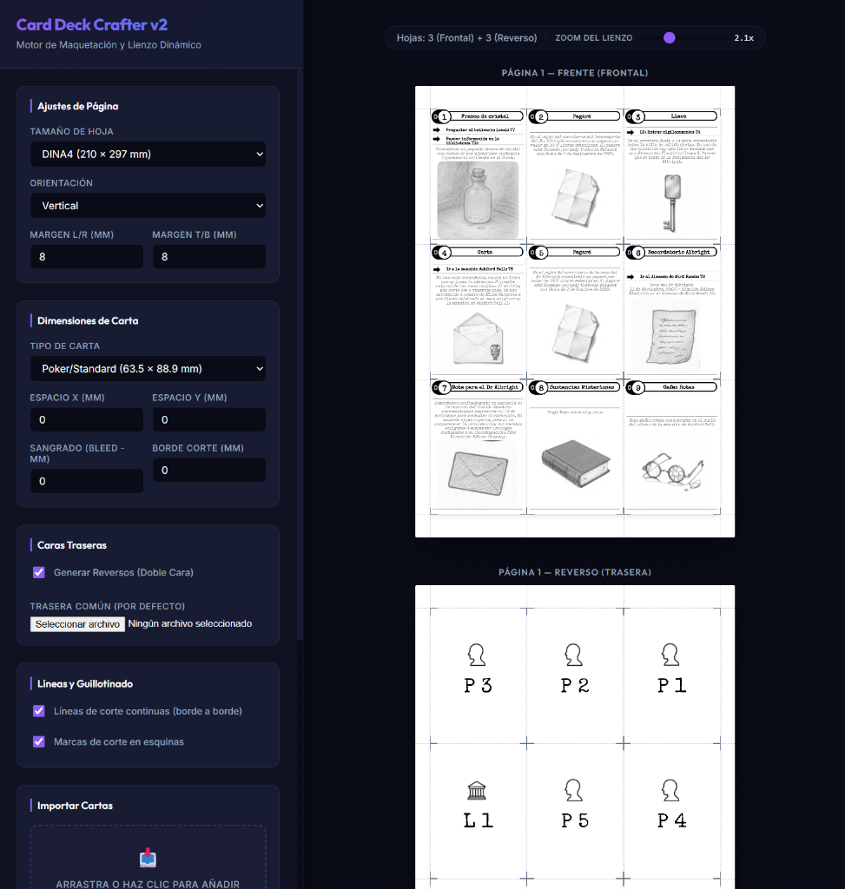

# Card Deck Crafter v2 (cdc2)

¡Bienvenido a **Card Deck Crafter v2**! Una herramienta modular de maquetación y diseño de cartas para prototipado rápido de juegos de mesa. Permite organizar y distribuir cartas de manera óptima para impresión en hojas físicas (A4, A3 o formatos personalizados), garantizando la alineación de caras traseras (espejado) y respetando marcas de corte y sangrados.



---

## 🚀 Guía rápida para Usuarios (No Desarrolladores)

Si solo deseas ejecutar la aplicación en tu computadora local para maquetar tus barajas, sigue estos sencillos pasos:

### 1. Requisitos Previos
*   Debes tener instalado **Node.js** (versión 18 o superior). Si no lo tienes, puedes descargarlo de forma gratuita para Windows, Mac o Linux desde la [página oficial de Node.js](https://nodejs.org/).

### 2. Descargar el Proyecto
1.  Descarga el código del repositorio en formato ZIP haciendo clic en el botón verde **Code** -> **Download ZIP** en la parte superior de esta página de GitHub.
2.  Extrae el archivo ZIP en una carpeta de tu ordenador.

### 3. Instalar y Arrancar
1.  Abre una consola, terminal o símbolo del sistema (cmd) en la carpeta donde has extraído los archivos.
2.  Ejecuta el siguiente comando para instalar las librerías necesarias (solo debes hacerlo la primera vez):
    ```bash
    npm install
    ```
3.  Una vez instalado, ejecuta el comando para iniciar el editor:
    ```bash
    npm run dev
    ```
4.  ¡Listo! Abre tu navegador en la siguiente dirección:
    👉 **http://localhost:5173/**

*(Nota: Para exportar a PDF de alta resolución, también necesitarás tener el servidor de exportación activo ejecutando `npm run server:dev` en otra terminal, una vez que esté completamente configurado).*

---

## 🛠️ Guía para Desarrolladores

El proyecto está estructurado como un Monorrepositorio utilizando **NPM Workspaces** para separar el cliente (React), el servidor (Express + Puppeteer) y la lógica matemática compartida de maquetación.

### Estructura de Directorios

*   [`/client`](file:///c:/Users/victo/proyectos/cdc2/client): Aplicación web SPA desarrollada en React, Vite y TypeScript.
*   [`/server`](file:///c:/Users/victo/proyectos/cdc2/server): Servidor backend en Node.js que utiliza Puppeteer para la generación headless de PDFs en alta resolución.
*   [`/shared`](file:///c:/Users/victo/proyectos/cdc2/shared): Biblioteca común que contiene el motor matemático de distribución de slots y cálculo de simetrías de reversos.
*   [`/developer`](file:///c:/Users/victo/proyectos/cdc2/developer): Documentación técnica del proyecto, especificaciones de requisitos (SRS) y directrices de desarrollo (Skills).

### Comandos de Desarrollo en la Raíz

Para ejecutar o compilar cualquier espacio de trabajo desde la raíz del monorepo, puedes usar los siguientes scripts:

*   **Arrancar el editor visual (Frontend)**:
    ```bash
    npm run client:dev
    ```
*   **Arrancar el servidor de exportación (Backend)** (en desarrollo):
    ```bash
    npm run server:dev
    ```
*   **Compilar el editor para producción**:
    ```bash
    npm run client:build
    ```
*   **Ejecutar pruebas unitarias automatizadas**:
    ```bash
    npm run test
    ```

### Lógica Compartida y Tests
El motor matemático de maquetación cuenta con una suite de pruebas para validar la distribución y simetría. Puedes verlas en [`shared/layoutEngine.test.ts`](file:///c:/Users/victo/proyectos/cdc2/shared/layoutEngine.test.ts).

Para más detalles de la arquitectura, revisa la documentación en la carpeta [`/developer`](file:///c:/Users/victo/proyectos/cdc2/developer).
