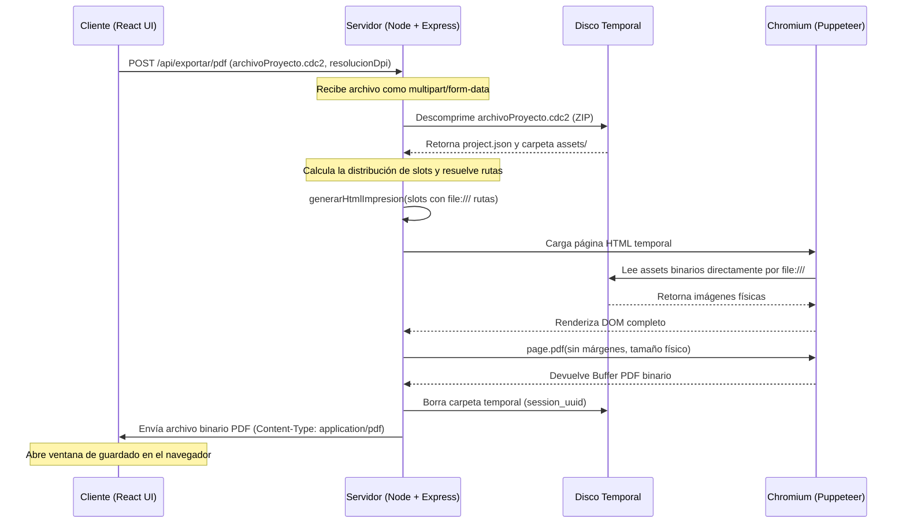

# Especificación Técnica - SRS-003: Motor de Renderizado Headless (Exportador a PDF y PNG)

## 1. Introducción y Objetivos
- **Módulo**: Servidor de Exportación y Renderizado Headless (Export Engine).
- **Propósito**: Permitir al usuario exportar su proyecto a un documento PDF de alta calidad (vectorial o imágenes de 300+ DPI) listo para impresión, utilizando un servidor local en Node.js que renderiza la cuadrícula de distribución mediante un navegador Chromium sin cabecera (headless) controlado por Puppeteer.
- **Objetivos de Diseño**:
  - **Fidelidad Física Absoluta**: El documento resultante debe respetar milimétricamente las dimensiones de lienzo, cartas y márgenes calculados por el motor de maquetación, sin variaciones debido a la pantalla del cliente.
  - **Resolución Variable**: Permitir la exportación a diferentes resoluciones (DPI) para equilibrar el peso del archivo y la calidad (ej. 72 DPI para borrador digital, 300 DPI para impresión comercial).
  - **Cero márgenes de Navegador**: Delegar todo el control de márgenes al algoritmo de maquetación puro, desactivando los márgenes del renderizador de PDF del navegador virtual.

---

## 2. Requisitos Funcionales y Casos de Uso

### RF-1: API del Servidor de Exportación (Local Backend)
- **RF-1.1**: El servidor local Node.js debe exponer un endpoint `POST /api/exportar/pdf`.
- **RF-1.2**: El endpoint recibirá la petición codificada como formulario multipart (`multipart/form-data`) que incluye:
  - El archivo binario `.cdc2` comprimido del proyecto bajo la clave `archivoProyecto`.
  - El parámetro `resolucionDpi: number` (ej. 72, 150, 300).
- **RF-1.3**: El servidor descomprimirá de forma temporal el archivo `.cdc2` en un directorio temporal en el disco local (`temp/exports/[session_uuid]/`) para acceder al archivo `project.json` y a los assets de la carpeta `assets/`.
- **RF-1.4**: Las referencias virtuales `asset://[nombre_archivo]` se mapearán a rutas físicas del disco usando el protocolo de archivo nativo `file:///[directorio_temporal]/assets/[nombre_archivo]`. Esto elimina la necesidad de codificar y transmitir gigabytes de Base64 por red, reduciendo a cero la latencia de conversión y el consumo excesivo de memoria RAM del servidor.
- **RF-1.5**: El endpoint debe devolver el chorro de bytes binarios del PDF resultante con la cabecera `Content-Type: application/pdf` e inmediatamente proceder a limpiar y borrar el directorio temporal del disco.

### RF-2: Renderizado Headless con Puppeteer
- **RF-2.1**: El servidor levantará un proceso en segundo plano de **Puppeteer** (navegador Chromium virtual) para cargar el HTML generado.
- **RF-2.2**: El sistema generará una plantilla HTML temporal dinámica que contenga el marcado de las páginas y la colocación absoluta de las cartas en base al resultado de la función `calcularDistribucion(...)`.
- **RF-2.3**: Las unidades milimétricas de la maquetación se convertirán a píxeles virtuales de acuerdo al DPI solicitado:
  $$\text{Píxeles} = \text{Milímetros} \times \left( \frac{\text{DPI}}{25.4} \right)$$
- **RF-2.4**: El navegador virtual cargará las imágenes de los slots de forma directa desde el disco local a través del protocolo `file://`, acelerando drásticamente el renderizado de texturas e imágenes grandes.
- **RF-2.5**: Puppeteer disparará la función `page.pdf()` configurando:
  - `width` y `height` de la página física exacta (ej. "210mm" x "297mm" para A4).
  - `margin: { top: 0, bottom: 0, left: 0, right: 0 }` (márgenes a cero).
  - `printBackground: true` (habilitar colores y recursos de fondo).
  - `preferCSSPageSize: true`.

---

## 3. Arquitectura y Flujo de Datos



---

## 4. Diseño del Módulo de Node.js (Servidor)

### 4.1. Generación del HTML Temporal
El servidor mapeará el layout a un documento HTML con estilos en línea optimizados para impresión:

```html
<!DOCTYPE html>
<html>
<head>
  <style>
    @page {
      size: 210mm 297mm; /* Ajustado dinámicamente según canvasConfig */
      margin: 0;
    }
    body {
      margin: 0;
      padding: 0;
      background-color: white;
    }
    .page {
      width: 210mm;
      height: 297mm;
      position: relative;
      page-break-after: always;
      overflow: hidden;
      box-sizing: border-box;
    }
    .slot {
      position: absolute;
      box-sizing: border-box;
    }
    .card-image {
      width: 100%;
      height: 100%;
      background-size: cover;
      background-position: center;
    }
    /* Líneas de corte continuas */
    .cut-line {
      position: absolute;
      border: 0.2mm dashed #000000;
    }
  </style>
</head>
<body>
  <!-- Una sección .page por cada página maquetada -->
  <div class="page">
    <div class="slot" style="left: 10mm; top: 10mm; width: 63.5mm; height: 88.9mm;">
      <!-- Las imágenes locales se cargan directamente con file:/// para evitar el coste y límites de base64 -->
      <div class="card-image" style="background-image: url('file:///c:/Users/victo/proyectos/cdc2/server/temp/exports/[session_uuid]/assets/carta_1_frontal.png')"></div>
    </div>
    <!-- Líneas de corte perimetrales -->
  </div>
</body>
</html>
```

### 4.2. Firma de la API Express/Fastify (Ficticia para Spec)
```typescript
import express from "express";
import multer from "multer";
import puppeteer from "puppeteer";
import unzipper from "unzipper"; // Para extraer el ZIP .cdc2
import fs from "fs-extra";
import path from "path";
import { v4 as uuidv4 } from "uuid";
import { calcularDistribucion } from "../shared/layoutEngine";

const app = express();
const upload = multer({ dest: "temp/uploads/" });

app.post("/api/exportar/pdf", upload.single("archivoProyecto"), async (req, res) => {
  const sessionUuid = uuidv4();
  const tempDir = path.join(__dirname, "temp/exports", sessionUuid);
  const zipPath = req.file?.path;

  try {
    if (!zipPath) throw new Error("Archivo de proyecto no recibido.");
    const resolucionDpi = Number(req.body.resolucionDpi) || 300;

    // 1. Descomprimir el archivo .cdc2 (ZIP) en disco
    await fs.ensureDir(tempDir);
    await fs.createReadStream(zipPath)
      .pipe(unzipper.Extract({ path: tempDir }))
      .promise();

    // 2. Leer el archivo de configuración project.json
    const projectJsonPath = path.join(tempDir, "project.json");
    const proyecto = await fs.readJson(projectJsonPath);

    // 3. Calcular la distribución física
    const layout = calcularDistribucion(
      proyecto.canvasConfig,
      proyecto.cardConfig,
      proyecto.cards,
      proyecto.modoTraseras,
      proyecto.imagenTraseraComun
    );

    // 4. Generar el HTML de impresión mapeando asset:// a rutas absolutas file:///
    const html = generarHtmlImpresion(proyecto.canvasConfig, layout, tempDir);

    // 5. Levantar el navegador Puppeteer y renderizar
    const browser = await puppeteer.launch({ 
      headless: true,
      args: ["--allow-file-access-from-files", "--enable-local-file-accesses"] // Clave para acceder a file:///
    });
    const page = await browser.newPage();
    await page.setContent(html, { waitUntil: "networkidle0" });

    // 6. Generar el PDF físico sin márgenes
    const pdfBuffer = await page.pdf({
      width: `${proyecto.canvasConfig.anchoMm}mm`,
      height: `${proyecto.canvasConfig.altoMm}mm`,
      margin: { top: 0, bottom: 0, left: 0, right: 0 },
      printBackground: true
    });

    await browser.close();

    // 7. Enviar PDF de respuesta
    res.contentType("application/pdf");
    res.send(pdfBuffer);

  } catch (error) {
    res.status(500).json({ error: error.message });
  } finally {
    // 8. Limpiar archivos temporales de forma incondicional
    if (zipPath) await fs.remove(zipPath);
    await fs.remove(tempDir);
  }
});
```

---

## 5. Estrategia de Verificación (Pruebas)

### 5.1. Pruebas Unitarias / de Integración del Backend
1. **Test: Cero Pérdida de Elementos**
   - Entrada: Petición con 1 página frontal conteniendo 9 cartas.
   - Salida esperada: El PDF resultante debe tener exactamente 1 página (y no 2 debido a desbordes de margen) y pesar una fracción de MB acorde a las imágenes de entrada.
2. **Test: Resolución y Nitidez**
   - Entrada: Exportar a 72 DPI y 300 DPI con el mismo proyecto.
   - Salida esperada: El buffer del PDF a 300 DPI debe ser significativamente más grande y contener las imágenes remuestreadas a alta densidad, garantizando que el texto dinámico y vectores permanezcan perfectos.

### 5.2. Pruebas Manuales (Lista de Verificación / Checklist)
- [ ] Hacer clic en el botón "Exportar PDF" en el cliente: Debe iniciar una petición al servidor local y descargar un archivo `.pdf`.
- [ ] Abrir el PDF en Acrobat Reader o Chrome: Las páginas del PDF deben mostrar exactamente la misma disposición que la pantalla. Las líneas de corte deben verse continuas y finas.
- [ ] Imprimir una página del PDF al 100% de escala (sin ajustar página): Medir con una regla física que las cartas en el papel impreso miden exactamente $63.5 \times 88.9\text{ mm}$ (tolerancia de $\pm 0.5\text{ mm}$).
