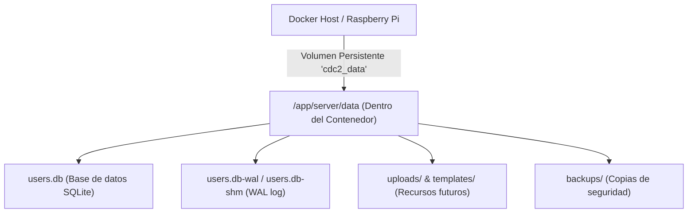

# Especificación Técnica - SRS-064: Persistencia con Volúmenes Docker, Docker Compose y Motor de Migraciones SQLite

- **ID de Especificación**: SRS-064
- **Título**: Persistencia con Volúmenes Docker, Orquestación con Docker Compose, Motor de Migraciones SQLite y Estabilidad en Servidores de Producción
- **Estado**: 🟡 Propuesta / En Definición
- **Fecha**: 2026-09-29
- **Autor**: Asistente de IA (Antigravity) & Usuario (enacefioh)
- **Hito Previo**: [SRS-063 (Panel de Administración Dedicado estilo WordPress)](file:///c:/Users/victo/proyectos/cdc2/developer/specs/completed/srs_063_panel_administracion_wordpress.md)

---

## 1. Introducción y Objetivos

### 1.1. Propósito
Garantizar la persistencia a largo plazo de la base de datos de usuarios (`users.db`), sesiones y futuros recursos (plantillas, ficheros, avatares) desacoplándolos del ciclo de vida efímero de los contenedores Docker. Adicionalmente, dotar al sistema de un motor automático de migraciones de base de datos (`PRAGMA user_version`) para que cualquier actualización de código aplique automáticamente cambios de esquema sin pérdida de datos, y resolver el fallo de despliegue detectado en servidores VPS con Node nativo/PM2.

### 1.2. Objetivos de Diseño
1. **Persistencia Total**: Desacoplar el almacenamiento de datos (`/app/server/data`) del contenedor mediante un volumen nombrado Docker (`cdc2_data`).
2. **Orquestación Declarativa (`docker-compose.yml`)**: Permitir el despliegue y reinicio de la aplicación con un solo comando (`docker compose up -d`) tanto en local como en entornos Raspberry Pi.
3. **Migraciones Automáticas y Seguras**: Evitar la ejecución manual de scripts SQL en producción. El backend comprobará al iniciar el número de versión del esquema en SQLite y ejecutará de forma transaccional las migraciones pendientes.
4. **Portabilidad y Backups Automatizables**: Proveer comandos para volcar (backup) y restaurar el contenido del volumen Docker a ficheros comprimidos estándar (`.tar.gz`).
5. **Resiliencia en Despliegue VPS (PM2 / Git Pull)**: Documentar y solventar el error actual 502 Bad Gateway derivado de la compilación nativa C++ de `better-sqlite3` en servidores que no usan Docker.

---

## 2. Requisitos Funcionales y Casos de Uso

### RF-1: Volumen Persistente Docker (`cdc2_data`)
- Se configurará el contenedor para montar un volumen persistente nombrado (`cdc2_data`) en la ruta interna `/app/server/data`.
- Toda base de datos SQLite (`users.db`), logs o ficheros de usuario generados por el backend se ubicarán exclusivamente dentro de este directorio montado.
- Al apagar, recrear o actualizar la imagen Docker (ej. `v2.260928.3` a una versión posterior), los datos del volumen permanecerán inalterados.

### RF-2: Orquestación Declarativa con `docker-compose.yml`
- Se creará en la raíz del proyecto un archivo `docker-compose.yml` optimizado:
  - Mapeo de puerto frontend: `80:5173`.
  - Mapeo de puerto backend API: `3000:3000`.
  - Montaje de volumen `cdc2_data:/app/server/data`.
  - Política de reinicio: `unless-stopped`.
  - Configuración de variables de entorno (ej. `CDC2_DB_PATH=/app/server/data/users.db`).
- Se añadirán scripts correspondientes en `package.json` (`docker:compose:up`, `docker:compose:down`).

### RF-3: Motor de Migraciones Automáticas SQLite (`MigrationManager`)
- Al arrancar el servidor backend (`server/src/index.ts`), antes de atender peticiones HTTP, se inicializará el subsistema de base de datos pasando por el gestor de migraciones.
- El gestor utilizará la directiva nativa de SQLite `PRAGMA user_version`.
- **Secuencia de Migraciones**:
  - `v0 -> v1`: Creación de tablas base de usuarios (`users`), sesiones (`sessions`) e índices de búsqueda (`idx_users_email`, `idx_sessions_user_id`).
  - Futuras versiones (`v1 -> v2`, etc.): Podrán añadir columnas (`ALTER TABLE`) o nuevas tablas con cuotas de disco o plantillas de usuario sin requerir interacción manual.
- Las migraciones se ejecutarán de forma transaccional: si una falla, se hace rollback y el servidor arroja un error crítico descriptivo.

### RF-4: Auto-generación de Directorios de Datos
- Al inicializar el backend, se asegurará la existencia de los subdirectorios requeridos dentro del volumen (`server/data/`, `server/data/backups/`, `server/data/uploads/`) mediante `fs.ensureDirSync`.

### RF-5: Herramientas de Backup y Restauración (UI en Panel de Admin y CLI)
- **Descarga / Exportación desde el Panel de Administración (Web)**:
  - Se implementará el endpoint administrativo `GET /api/admin/backup/export` (protegido por `requireAdmin`).
  - El backend consolida el WAL (`wal_checkpoint(TRUNCATE)`), empaqueta el contenido de `server/data/` (excluyendo la subcarpeta de copias históricas `backups/`) en un `.zip` con `adm-zip` y lo transmite al navegador.
  - En [`AdminPanel.tsx`](file:///c:/Users/victo/proyectos/cdc2/client/src/admin/AdminPanel.tsx), botón interactivo **"⬇️ Descargar Copia de Seguridad (.zip)"**.
- **Restauración / Importación desde el Panel de Administración (Web)**:
  - Se implementará el endpoint administrativo `POST /api/admin/backup/import` (protegido por `requireAdmin` y `multer`).
  - Valida el fichero `.zip` recibido asegurando que contiene `users.db` y datos íntegros.
  - Genera automáticamente un snapshot preventivo de rescate (`auto_pre_restore_<timestamp>.zip`) en `server/data/backups/`.
  - Cierra de forma ordenada la conexión activa de SQLite (`repo.close()`), sustituye los archivos en `server/data/`, limpia archivos temporales de WAL (`users.db-wal`, `users.db-shm`) y reabre la base de datos (`repo.reopen()`).
  - Ejecuta inmediatamente el motor de migraciones (`MigrationManager`) para garantizar que si el backup proviene de una versión anterior, la base de datos se actualiza al esquema actual de forma transparente.
  - En [`AdminPanel.tsx`](file:///c:/Users/victo/proyectos/cdc2/client/src/admin/AdminPanel.tsx), botón **"⬆️ Restaurar Copia (.zip)"** con selector de fichero y diálogo de confirmación de seguridad que advierte del reemplazo de datos y solicita confirmación antes de proceder.
- **Herramientas CLI de Docker**:
  - `npm run docker:volume:backup`: Exporta el volumen `cdc2_data` a un archivo `.tar.gz` en el host.
  - `npm run docker:volume:restore`: Restaura el archivo `.tar.gz` en el volumen `cdc2_data` mediante un contenedor efímero.

### RF-6: Diagnóstico y Solución para Servidores VPS (Git + PM2)
- El despliegue actual en `https://cdc2.enacefio.com/` falló con `502 Bad Gateway` en `/api/*` porque `better-sqlite3` es un módulo binario con código nativo C++ que requiere herramientas de compilación (`make`, `g++`, `python3`, `node-gyp`) en el servidor Ubuntu que aloja PM2.
- Se actualizará la guía técnica [`developer/guia-despliegue-mantenimiento.md`](file:///c:/Users/victo/proyectos/cdc2/developer/guia-despliegue-mantenimiento.md) y el flujo de GitHub Actions (`.github/workflows/deploy.yml`) para asegurar que:
  1. El servidor instale `build-essential`.
  2. El paso de despliegue ejecute `npm rebuild better-sqlite3` antes de reiniciar PM2.
  3. Se verifique la versión de Node y los permisos de escritura sobre `/var/www/cdc/server/data/`.

---

## 3. Arquitectura y Diseño de Datos

### 3.1. Interfaz de Migración (`server/src/db/migrations.ts`)
```typescript
import type { Database as DatabaseType } from "better-sqlite3";

export interface Migration {
  version: number;
  description: string;
  up: (db: DatabaseType) => void;
}
```

### 3.2. Mapeo de Volúmenes y Persistencia


---

## 4. Interfaces y Configuración

### 4.1. Archivo `docker-compose.yml`
```yaml
services:
  cdc2:
    image: cdc2:local
    container_name: cdc2_app
    ports:
      - "80:5173"
      - "3000:3000"
    environment:
      - NODE_ENV=production
      - CDC2_DB_PATH=/app/server/data/users.db
    volumes:
      - cdc2_data:/app/server/data
    restart: unless-stopped

volumes:
  cdc2_data:
    name: cdc2_data
```

### 4.2. Scripts en `package.json`
- `"docker:run"`: Actualizado para incluir `-v cdc2_data:/app/server/data`.
- `"docker:compose:up"`: `docker compose up -d`.
- `"docker:compose:down"`: `docker compose down`.
- `"docker:volume:backup"`: Genera archivo `cdc2_data_backup_<timestamp>.tar.gz` en el host.
- `"docker:volume:restore"`: Restaura archivo `cdc2_backup.tar.gz` hacia el volumen `cdc2_data`.

---

## 5. Estrategia de Verificación

### 5.1. Pruebas Unitarias Automatizadas
- Test de `MigrationManager` con SQLite en memoria (`:memory:`):
  - Verifica que en una base de datos vacía se aplican todas las migraciones registradas.
  - Verifica que `PRAGMA user_version` se incrementa al número de versión más alto.
  - Verifica que al volver a ejecutar el gestor en una base de datos ya migrada, no se re-ejecutan las migraciones (idempotencia).
  - Simula la adición de una migración `v2` sobre una base en `v1` comprobando que añade columnas sin perder filas existentes.
- Test de endpoints de backup y restauración:
  - `GET /api/admin/backup/export` descarga `.zip`.
  - `POST /api/admin/backup/import` restaura y valida datos.

### 5.2. Pruebas Manuales / Criterios de Aceptación (Checklist)
- [ ] Ejecutar el contenedor con `docker compose up -d` (o `npm run docker:run`).
- [ ] Crear un usuario y contraseña de administrador desde la interfaz web.
- [ ] Detener y eliminar el contenedor: `docker stop cdc2_app && docker rm cdc2_app`.
- [ ] Volver a arrancar el contenedor con una nueva imagen o reinicio: `docker compose up -d`.
- [ ] Comprobar que en `http://localhost/` el usuario previamente creado sigue existiendo e inicia sesión sin pedir el asistente inicial de bienvenida.
- [ ] Ejecutar el script de backup y comprobar que se genera el archivo `.tar.gz` con el fichero `users.db`.
- [ ] Probar la exportación de backup `.zip` desde el Panel de Administración.
- [ ] Probar la importación / restauración de backup `.zip` desde el Panel de Administración y comprobar que los datos se restauran correctamente.
- [ ] Ejecutar las instrucciones de reparación en el servidor VPS y verificar que `/api/auth/setup-status` devuelve HTTP 200 en lugar de 502 Bad Gateway.

