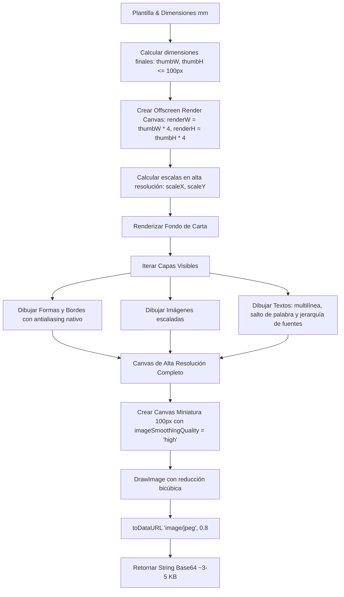

# SRS-074: Renderizado en Alta Resolución y Super-Sampling (SSAA) para Miniaturas de Plantillas

## 1. Introducción y Objetivos
- **Propósito**: Resolver la degradación visual, distorsión tipográfica, pérdida de jerarquía y deformación de textos que ocurren al generar las miniaturas de las plantillas de cartas (`thumbnailUtils.ts`) al guardarlas en el proyecto o exportarlas.
- **Problema Detectado**:
  - Actualmente, `generarMiniaturaPlantilla` dibuja directamente sobre un canvas con dimensión máxima de 100px (aproximadamente 71x100px en cartas tipo póker).
  - A esa resolución, la densidad es de apenas ~1.12 px/mm. Las fuentes estándar (8pt a 12pt) calculan un tamaño de 2.8 a 4.2 píxeles. La función aplica `Math.max(5, fontSizePx)`, obligando a que textos secundarios, párrafos y títulos queden forzados a un tamaño idéntico de 5px borrosos, eliminando la jerarquía visual de la carta.
  - Además, se ejecuta `ctx.fillText(textContent, textX, y, w)` en una sola línea pasando el ancho máximo `w`, lo que comprime horizontalmente el texto de forma desproporcionada y aplasta los caracteres si el texto supera el ancho disponible.
  - Los contenedores con disposición en columna o flujo flex no computan el avance vertical entre capas hijas, provocando solapamiento de elementos en la posición inicial.
- **Objetivos de Diseño**:
  - **Super-Sampling Anti-Aliasing (SSAA)**: Renderizar la carta en memoria en un canvas de alta resolución ("render buffer") utilizando un factor multiplicador (4x, equivalente a ~4.48 px/mm o un lienzo de ~284x400px a ~400x560px). A esta escala, las fuentes se computan en tamaños legibles (15-25px), los grosores de trazo son precisos y el motor de dibujo aplica antialiasing subpíxel óptimo.
  - **Downscaling Bicúbico de Alta Calidad**: Reducir el buffer de alta resolución al canvas de miniatura final (máx. 100px) mediante interpolación bicúbica (`imageSmoothingQuality = "high"`), logrando una miniatura suave y nítida.
  - **Ajuste de Línea Inteligente (Word Wrapping)**: Permitir que los textos con saltos de línea (`\n`) o párrafos largos se dividan en varias líneas según el ancho de la caja sin aplastamiento horizontal.
  - **Flujo en Contenedores**: Calcular el desplazamiento vertical para hijos en contenedores o listas flex verticales básicas.
  - **Ligereza y Retrocompatibilidad**: La salida sigue siendo un Data URL JPEG a calidad 0.8 con resolución máxima de 100px, por lo que el peso en bytes dentro del archivo de proyecto o plantilla (.cdc2 / .cdc2t) permanece entre 3-6 KB.

---

## 2. Requisitos Funcionales y Casos de Uso

### RF-1: Buffer de Renderizado en Alta Resolución (Hi-Res Offscreen Canvas)
- La función utilitaria `generarMiniaturaPlantilla` calculará en primer lugar las dimensiones de la miniatura final (máximo 100px en su lado más largo, conservando la relación de aspecto).
- Para el dibujo real, instanciará un canvas intermedio de alta resolución con un factor de super-sampling de 4x (`SUPERSAMPLE_FACTOR = 4`):
  - Ancho de render: `renderW = thumbW * 4` (ej. 71 * 4 = 284 px).
  - Alto de render: `renderH = thumbH * 4` (ej. 100 * 4 = 400 px).
- Las escalas de coordenadas para el renderizado serán:
  - `scaleX = renderW / anchoMm`
  - `scaleY = renderH / altoMm`
- Todos los elementos (fondos, rectángulos con bordes redondeados, imágenes y textos) se dibujarán sobre este canvas de alta resolución.

### RF-2: Downscaling Bicúbico a Miniatura Final
- Una vez completado el dibujo de todas las capas visibles en el canvas de alta resolución:
  - Se creará el canvas final de dimensiones mini (`thumbW` x `thumbH`, máx. 100px).
  - Se configurará el contexto del canvas final:
    ```typescript
    thumbCtx.imageSmoothingEnabled = true;
    thumbCtx.imageSmoothingQuality = "high";
    ```
  - Se volcará el canvas de alta resolución completo en el canvas final mediante:
    ```typescript
    thumbCtx.drawImage(renderCanvas, 0, 0, renderW, renderH, 0, 0, thumbW, thumbH);
    ```
  - Se exportará el resultado a JPEG con compresión 0.8:
    ```typescript
    return thumbCanvas.toDataURL("image/jpeg", 0.8);
    ```

### RF-3: Renderizado Tipográfico Nítido y Manejo Multilínea
- **Cálculo de Fuente**:
  - En el buffer de 4x, el tamaño de fuente en píxeles se calcula como:
    ```typescript
    const fontSizePx = Math.max(8, (capa.fontSizePt || 10) * 0.352778 * scaleY);
    ```
  - Esto evita que los textos queden comprimidos al mínimo absoluto y preserva la escala relativa entre títulos y cuerpos de texto.
- **Salto de Línea y Partición de Texto**:
  - Se sustituirá el `fillText` comprimido por una función de división de texto multilínea:
    - Se procesan los saltos de línea explícitos (`\n`).
    - Si una línea excede el ancho de la caja (`w`), se divide por palabras.
    - El interlineado se calculará con `lineHeight = fontSizePx * 1.2`.
    - Se dibujará cada línea de texto dentro del área recortada (`ctx.clip()`) de la capa, deteniéndose si el texto excede la altura disponible de la caja.

### RF-4: Disposición de Hijos en Contenedores Flex Verticales
- Si una capa pertenece a un contenedor vertical (`isFlexLayout` con dirección vertical o columna):
  - Se calculará de forma acumulativa la posición `y` de los hijos directos teniendo en cuenta la altura y espaciado de las capas hermanas anteriores.
  - Esto evita que todos los elementos hijos se dibujen apilados en la coordenada (0, 0) del contenedor.

### RF-5: Tratamiento de Imágenes y Formas Vectoriales
- Las formas rectangulares, bordes (`roundRect`) y fondos mantendrán bordes suaves y anti-aliasing natural gracias a la interpolación al reducir la escala.
- Las imágenes de capas (`image` o `image-switch`) se dibujan en alta resolución antes del downscaling, preservando la nitidez de logotipos e ilustraciones sin pixelado brusco.

---

## 3. Arquitectura y Diseño de Datos

### 3.1. Constantes y Módulo (`client/src/utils/thumbnailUtils.ts`)
```typescript
export const THUMBNAIL_MAX_DIMENSION = 100;
export const THUMBNAIL_SUPERSAMPLE_FACTOR = 4;
export const THUMBNAIL_JPEG_QUALITY = 0.8;
```

### 3.2. Flujo de Generación


---

## 4. Interfaces de Componentes / API

### 4.1. Firma Pública de `thumbnailUtils.ts`
```typescript
/**
 * Renderiza una miniatura JPEG en Base64 para una plantilla dada utilizando
 * Super-Sampling Anti-Aliasing (SSAA) y reducción bicúbica de alta calidad.
 *
 * @param plantilla Objeto de plantilla con sus capas y configuraciones
 * @param anchoMmProp Ancho en mm de la carta (fallback si no viene en plantilla)
 * @param altoMmProp Alto en mm de la carta (fallback si no viene en plantilla)
 * @returns Promise<string> Data URL "data:image/jpeg;base64,..."
 */
export async function generarMiniaturaPlantilla(
  plantilla: PlantillaCDC2 | any,
  anchoMmProp?: number,
  altoMmProp?: number
): Promise<string>;
```

### 4.2. Funciones Auxiliares Internas
- `dividirTextoEnLineas(ctx: CanvasRenderingContext2D, texto: string, maxW: number): string[]`: Algoritmo de partición de párrafos y saltos de línea basado en el ancho máximo en píxeles.
- `calcularCoordenadasAbsolutas(capa: any, capas: any[]): { xMm: number; yMm: number }`: Cálculo recursivo de coordenadas respecto al lienzo de la carta con soporte para contenedores.

---

## 5. Estrategia de Verificación (Pruebas)

### 5.1. Pruebas Unitarias Automatizadas (`client/src/SRS074ThumbnailSuperSampling.test.tsx`)
1. **Factor de Super-Sampling**: Verificar que se crea internamente un canvas con dimensiones multiplicadas por `THUMBNAIL_SUPERSAMPLE_FACTOR` (4x) y un canvas final con las dimensiones de miniatura (máx. 100px).
2. **Configuración de Suavizado Bicúbico**: Validar que el contexto del canvas final activa `imageSmoothingEnabled = true` y `imageSmoothingQuality = "high"`.
3. **Manejo de Texto Multilínea**: Comprobar que textos con saltos de línea (`\n`) o textos largos no se comprimen en una sola llamada de dibujo, sino que realizan las llamadas correspondientes respetando las líneas.
4. **Respeto de Jerarquía Tipográfica**: Validar que un texto con tamaño 18pt recibe un tamaño de fuente mayor en píxeles que uno de 8pt, sin que ambos queden fijados al mismo tamaño mínimo.
5. **Formato y Peso de Salida**: Comprobar que la función retorna un Data URL válido que inicia con `data:image/jpeg;base64,`.

### 5.2. Pruebas Manuales / Criterios de Aceptación (Checklist)
- [ ] **1. Guardar plantilla con textos variados**:
  - Abrir el editor de cartas, crear una carta con un título (16pt, negrita), un subtítulo (11pt) y un párrafo descriptivo largo (8pt con varias líneas).
  - Pulsar en "Guardar plantilla en el proyecto".
- [ ] **2. Comprobar miniatura en el selector**:
  - Abrir el modal "Añadir Carta desde Plantilla".
  - Observar la miniatura generada para la plantilla recién guardada:
    - El título, subtítulo y texto descriptivo deben mantener su proporción relativa visible.
    - El texto no debe verse achatado ni aplastado horizontalmente.
    - Los bordes y colores deben verse nítidos y sin artefactos dentados.
- [ ] **3. Guardar plantilla con imágenes y formas**:
  - Crear una plantilla con una imagen o logotipo y un contenedor con esquinas redondeadas.
  - Guardar la plantilla y verificar que en la miniatura las esquinas redondeadas son suaves y la imagen se distingue claramente.
- [ ] **4. Comprobación de peso y rendimiento**:
  - Exportar el proyecto a `.cdc2` y verificar que el tamaño del archivo sigue siendo ligero.
  - Verificar que el guardado de la plantilla ocurre de forma instantánea sin pausas perceptibles en la interfaz.
