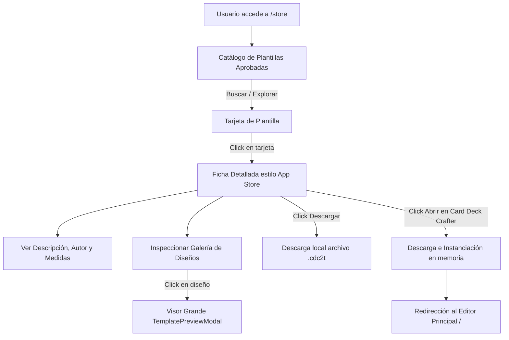

# SRS-076: Tienda Pública de Plantillas (/store), Ficha Estilo App Store y Apertura Directa en el Editor (Fase 2)

## 1. Introducción y Objetivos
- **Propósito**: Proporcionar una plataforma comunitaria accesible bajo la subruta `/store` (ej. `https://cdc2.enacefio.com/store` o `http://localhost/store`) donde cualquier usuario o visitante pueda descubrir, explorar e inspeccionar plantillas de juegos de mesa creadas y publicadas por la comunidad de Card Deck Crafter v2.
- **Objetivos de Diseño**:
  - **Acceso Público Universal**: La tienda es accesible de forma libre sin requerir inicio de sesión obligatorio para consultar el catálogo, ver los detalles de las plantillas o abrirlas en el editor.
  - **Experiencia de Usuario tipo App Store (Google Play / Apple App Store)**:
    - Vista de catálogo con buscador en tiempo real, filtros y tarjetas atractivas con miniaturas y metadatos.
    - Ficha detallada de plantilla con cabecera prominente, autor, dimensiones, descripción extendida y galería de capturas/diseños con visor ampliado a pantalla completa.
  - **Onboarding sin Fricción (Apertura Directa)**: Botón principal "🚀 Abrir con Card Deck Crafter" que descarga e instancia la plantilla en un proyecto nuevo limpio en memoria en un solo clic, permitiendo a nuevos creadores comenzar a maquetar de inmediato.
  - **Descarga Local Alternativa**: Botón para descargar directamente el archivo binario `.cdc2t` al ordenador del usuario.
  - **Navegación Fluida**: Transición natural entre el editor principal y la tienda comunitaria.

---

## 2. Requisitos Funcionales y Casos de Uso

### RF-1: Subruta de la Tienda (`/store`) y Navegación
- La aplicación web reconoce la ruta `/store` en el navegador:
  - Si el usuario accede a `https://cdc2.enacefio.com/store` o `http://localhost/store`, se muestra la interfaz de la Tienda de Plantillas.
  - En la barra superior (`MenuBar.tsx`), se añade un botón de acceso directo: **"🏪 Tienda de Plantillas"**.
  - En la cabecera de la tienda, se dispone de un botón permanente: **"🎴 Ir al Editor de Cartas"**.
  - Permite volver atrás mediante el historial del navegador (`pushState` / `popstate`).

### RF-2: API Pública de la Tienda (Sin Autenticación Obligatoria)
- `GET /api/store/templates`:
  - Retorna la lista de plantillas con `status = 'approved'`.
  - Soporta parámetro de búsqueda por texto `?q=` (filtra por nombre, descripción y autor).
  - Devuelve metadatos públicos: `id`, `name`, `description`, `authorName`, `documentCount`, `templateCount`, `fileSizeBytes`, `updatedAt`, `previewCards` (dimensiones en mm, nombre de diseño y miniatura JPEG Base64).
- `GET /api/store/templates/:id`:
  - Retorna el detalle completo de la plantilla aprobada.
- `GET /api/store/templates/:id/download`:
  - Endpoint de descarga pública del archivo `.cdc2t` desde `/server/data/public_templates/`.

### RF-3: Catálogo Público de Plantillas (Store Home)
- **Buscador y Filtros**:
  - Caja de búsqueda interactiva con filtrado inmediato por palabras clave.
  - Contador de plantillas disponibles (ej. "12 plantillas comunitarias disponibles").
- **Cuadrícula de Tarjetas de Plantilla**:
  - Cada tarjeta presenta:
    - Carátula / miniatura del diseño principal (generada con el renderizado de alta resolución SRS-074).
    - Título público de la plantilla.
    - Autor con distintivo (`👤 @autor`).
    - Badges técnicos: Medidas principales (ej. `63.5 x 88.9 mm`), número de diseños de carta y tamaño en MB.
    - Al hacer clic en la tarjeta, navega a la Ficha Detallada.

### RF-4: Ficha Detallada de Plantilla (Estilo App Store / Google Play)
- **Cabecera de la Ficha**:
  - Carátula destacada de la plantilla.
  - Título público en tamaño grande y visible.
  - Nombre del autor (`Publicado por @username`) y fecha de actualización.
  - Etiquetas resumen: Formato de carta (mm), número de documentos incluidos, cantidad de diseños.
  - **Botones de Acción Principales**:
    - Botón primario de gran tamaño: **"🚀 Abrir en Card Deck Crafter"**.
    - Botón secundario: **"⬇️ Descargar archivo (.cdc2t)"**.
- **Galería de Capturas y Diseños de Cartas**:
  - Carrusel / cuadrícula horizontal que expone las miniaturas de todas las cartas y diseños contenidos en la plantilla (frontales, reversos, variantes).
  - Al hacer clic en cualquiera de las miniaturas, se abre el visor modal ampliado (`TemplatePreviewModal` / lightbox de previsualización) permitiendo inspeccionar cada capa, tipografía y detalles a tamaño completo.
- **Descripción y Notas del Creador**:
  - Sección espaciosa con el texto descriptivo extendido redactado por el autor: mecánicas recomendadas, especificaciones para imprenta, instrucciones y notas de autor.

### RF-5: Apertura Directa en el Editor
- Al pulsar **"🚀 Abrir en Card Deck Crafter"**:
  1. Si el usuario ya tenía cartas o proyectos abiertos con cambios sin guardar en su sesión actual del editor, se muestra un modal de advertencia de guardado ("Tienes un proyecto activo en el editor. ¿Deseas sustituirlo por esta plantilla?").
  2. Si el usuario confirma (o no tenía proyecto abierto), la aplicación descarga la plantilla mediante `/api/store/templates/:id/download`.
  3. Desempaqueta e instancia la plantilla como un proyecto nuevo limpio en memoria (utilizando la lógica existente de `validarYParsearPlantilla` e `insertarCartaDesdePlantilla`).
  4. Redirige automáticamente a la vista principal del editor (`/`), dejando al creador listo para diseñar con la plantilla ya cargada.

---

## 3. Arquitectura y Diseño de Componentes

### 3.1. Estructura de Módulos en el Cliente (`client/src/store/`)
```
client/src/
  ├── store/
  │    ├── StoreApp.tsx            # Vista contenedora principal de la tienda (/store)
  │    ├── StoreCatalog.tsx        # Cuadrícula de tarjetas y buscador
  │    ├── StoreTemplateDetail.tsx # Ficha detallada estilo App Store
  │    └── StoreNavbar.tsx         # Barra superior de la tienda con buscador y retorno al editor
  ├── services/
  │    └── storeService.ts         # Llamadas fetch a /api/store/*
  └── components/
       └── TemplatePreviewModal.tsx # Reutilización de visor grande
```

### 3.2. Rutas del Servidor (`server/src/store/`)
- Módulo `server/src/store/storeRoutes.ts` montado en `/api/store`:
  - `GET /api/store/templates`: Consulta `public_templates WHERE status = 'approved'`.
  - `GET /api/store/templates/:id`: Consulta por ID pública.
  - `GET /api/store/templates/:id/download`: `res.download(filePath, filename)`.

### 3.3. Diagrama de Flujo del Usuario


---

## 4. Interfaces de Componentes / API

### 4.1. Contrato TypeScript Público (`shared/storeTypes.ts`)
```typescript
export interface StoreTemplateCard {
  id: string;
  name: string;
  description: string;
  authorName: string;
  documentCount: number;
  templateCount: number;
  fileSizeBytes: number;
  updatedAt: string;
  thumbnail?: string; // Miniatura de la primera carta/diseño
  previewCards?: Array<{
    nombre: string;
    anchoMm: number;
    altoMm: number;
    miniatura?: string;
  }>;
}

export interface StoreTemplateDetail extends StoreTemplateCard {
  originalTemplateId: string;
  authorId: string;
}
```

### 4.2. Funciones del Servicio Cliente (`client/src/services/storeService.ts`)
```typescript
export async function fetchStoreTemplates(query?: string): Promise<StoreTemplateCard[]>;
export async function fetchStoreTemplateDetail(id: string): Promise<StoreTemplateDetail>;
export function getStoreTemplateDownloadUrl(id: string): string;
export async function downloadAndInstantiateTemplate(templateId: string): Promise<any>;
```

---

## 5. Estrategia de Verificación (Pruebas)

### 5.1. Pruebas Unitarias Automatizadas (`client/src/SRS076StorePublicaPlantillas.test.tsx`)
1. **API Pública del Catálogo**:
   - Verificar que `GET /api/store/templates` devuelve exclusivamente plantillas con estado `'approved'`.
   - Verificar que el parámetro de búsqueda `?q=` filtra correctamente por título o autor.
2. **Renderizado de la Ficha Estilo App Store**:
   - Comprobar que `StoreTemplateDetail` renderiza la cabecera, nombre del autor, badges de medidas, descripción extendida y galería de miniaturas.
3. **Visor Grande de Galería**:
   - Comprobar que al hacer clic en un diseño de la galería se abre el visor `TemplatePreviewModal` correspondiente.
4. **Acción de Apertura en Editor**:
   - Comprobar que pulsar "Abrir en Card Deck Crafter" dispara la descarga y parseo de la plantilla hacia el estado de proyecto.

### 5.2. Pruebas Manuales / Criterios de Aceptación (Checklist)
- [ ] **1. Navegación hacia `/store`**:
  - En la barra de menús principal de la aplicación, pulsar en **"🏪 Tienda de Plantillas"**.
  - Verificar que la URL cambia a `/store` y se presenta la interfaz de la tienda.
- [ ] **2. Catálogo y Búsqueda**:
  - Observar las tarjetas de plantillas aprobadas.
  - Probar el buscador escribiendo el nombre de una plantilla o autor y verificar el filtrado inmediato.
- [ ] **3. Ficha Detallada estilo App Store**:
  - Hacer clic en una plantilla del catálogo.
  - Verificar que se abre la ficha con su cabecera, autor, descripción ampliada y galería de capturas.
  - Hacer clic en una de las miniaturas de la galería y comprobar que se abre el visor en grande para inspeccionar la carta.
- [ ] **4. Descarga del archivo `.cdc2t`**:
  - Pulsar en **"⬇️ Descargar archivo"** y comprobar que se descarga el fichero en el navegador.
- [ ] **5. Apertura Directa en el Editor**:
  - Pulsar en **"🚀 Abrir en Card Deck Crafter"**.
  - Verificar que la aplicación cambia automáticamente a la pantalla del editor (`/`) y carga el proyecto listo con dicha plantilla seleccionada para crear cartas.
