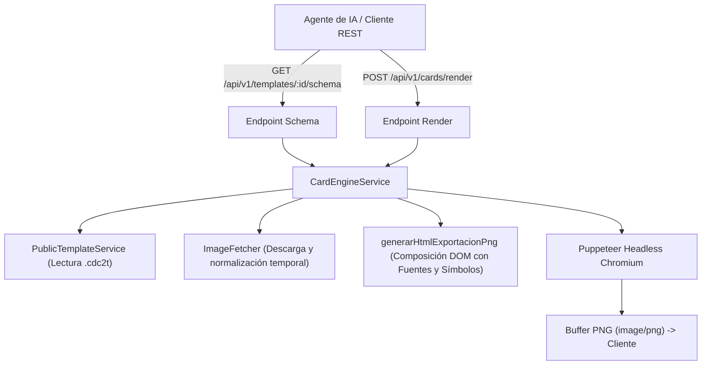

# SRS-077: Motor API REST para Renderizado Headless de Cartas con IA a partir de Plantillas Públicas

---

## 1. Introducción y Objetivos

### Propósito
Proveer un motor programático desacoplado y una API REST pública en Card Deck Crafter v2 (CDC2) que permita a agentes de Inteligencia Artificial (y scripts automatizados externos) inspeccionar las plantillas públicas disponibles, descubrir sus campos editables expuestos y **renderizar cartas directamente en imágenes PNG de alta resolución (300 DPI)**.

> [!NOTE]
> La exportación o generación de cartas en formato JSON / proyectos `.cdc2` se desacopla deliberadamente de esta especificación y se abordará en una especificación posterior (junto con SRS-056). Esto evita inconsistencias de recursos huérfanos (fuentes `@font-face`, símbolos del proyecto y rutas relativas de assets `asset://`) que ocurrirían si se exportara un JSON aislado sin empaquetar adecuadamente sus dependencias.

Esta especificación constituye la **Fase 1** (Descubrimiento de Esquemas y Motor Headless de Renderizado PNG), sirviendo como base indispensable para la futura **Fase 2** (Servidor MCP - Model Context Protocol y autenticación de usuario).

### Objetivos de Diseño
- **Acceso Público Directo**: Operar inicialmente sobre plantillas públicas comunitarias aprobadas sin requerir credenciales complejas en esta primera fase.
- **Descubrimiento Semántico de Esquemas**: Exponer los campos y propiedades editables en un formato estandarizado y autodescriptivo que un LLM pueda interpretar sin ambigüedades.
- **Soporte para Multimedia e Ilustraciones**: Permitir que los campos de tipo imagen acepten URLs externas (HTTP/HTTPS) o Base64 Data URLs, encargándose el backend de su descarga, almacenamiento temporal e inyección en el renderizado.
- **Rendimiento y Limpieza**: Reutilizar el motor de Chromium headless existente en Docker aislando las sesiones en directorios temporales efímeros con limpieza garantizada.

---

## 2. Requisitos Funcionales y Casos de Uso

### RF-1: Inspección de Esquema y Campos Expuestos (`GET /api/v1/templates/:id/schema`)
- **Descripción**: El sistema debe proporcionar un endpoint que reciba el identificador de una plantilla pública aprobada y devuelva el manifiesto técnico de sus diseños de carta y campos editables.
- **Criterios de Aceptación**:
  - Si la plantilla no existe o su estado no es `approved`, debe responder `404 Not Found`.
  - Debe listar todos los diseños de cartas contenidos en la plantilla (excluyendo la plantilla base `vacia` si existen diseños reales).
  - Por cada diseño de carta, debe incluir:
    - `id`: Identificador único del diseño (ej. `template_1785...`).
    - `nombre`: Nombre legible (ej. *Enemigo*, *Apoyo*, *Reglas*).
    - `dimensiones`: Objeto `{ anchoMm, altoMm }`.
    - `totalCapas`: Cantidad de capas que componen el diseño.
    - `campos`: Lista de campos editables derivados de `camposConfig` y `exposedProperties`, indicando:
      - `clave`: Clave del campo para mapeo de valores.
      - `nombre`: Etiqueta legible.
      - `tipo`: Tipo de dato (`string`, `multiline`, `number`, `image`, `select`, `boolean`).
      - `descripcion`: Descripción o instrucciones del campo si están disponibles.
      - `valorDefecto`: Valor predeterminado si existe.
      - `opciones`: Lista de valores permitidos si el tipo es `select` (o si es una capa `image-switch`).

### RF-2: Renderizado Headless de Carta Individual en PNG (`POST /api/v1/cards/render`)
- **Descripción**: El sistema debe recibir la definición de una carta para un diseño específico de una plantilla pública, generar la composición visual mediante Chromium headless (Puppeteer) y responder con el archivo binario `image/png`.
- **Criterios de Aceptación**:
  - Parámetros de entrada en JSON:
    - `templateId`: ID de la plantilla pública aprobada.
    - `cardDesignId`: ID del diseño de carta dentro de la plantilla.
    - `fields`: Objeto clave-valor con los textos/números a inyectar en `valoresCampos`.
    - `images` (opcional): Diccionario `{ [claveOCapaId]: string }` donde el valor puede ser una URL HTTP/HTTPS o un Base64 `data:image/...`.
    - `dpi` (opcional): Resolución deseada (por defecto 300 DPI, `scaleFactor: 3.125`).
  - **Resolución de Recursos**:
    - Las fuentes tipográficas personalizadas (`customFonts`) y los símbolos del proyecto (`projectSymbols`) contenidos en el archivo `.cdc2t` de la plantilla deben cargarse e inyectarse en el documento HTML antes de realizar la captura.
    - Las imágenes externas provistas deben ser descargadas y validadas en un directorio temporal de sesión.
  - **Respuesta**:
    - Cabecera `Content-Type: image/png`.
    - Cuerpo binario de la imagen renderizada a escala exacta y alta fidelidad.
  - **Gestión de Recursos Temporales**:
    - Todos los archivos temporales generados durante la sesión deben ser eliminados de forma síncrona/asíncrona garantizada, incluso en caso de fallo durante el renderizado.

### RF-3: Panel de Integración y Endpoints en la Ficha de la Tienda (`StoreTemplateDetail.tsx`)
- **Descripción**: La página de detalle de cada plantilla pública en `/store` debe incorporar una sección visible y accesible dedicada a la integración con Agentes de IA y API REST.
- **Criterios de Aceptación**:
  - Ubicación: en la vista de detalle de la plantilla ([StoreTemplateDetail.tsx](file:///c:/Users/victo/proyectos/cdc2/client/src/store/StoreTemplateDetail.tsx)), bajo la sección de plantillas de cartas o tras la descripción.
  - Muestra claramente los endpoints con la ID de la plantilla específica:
    - Endpoint para obtener el esquema: `GET /api/v1/templates/:id/schema`
    - Endpoint para renderizar: `POST /api/v1/cards/render`
  - Incluye botones interactivos de "Copiar" (📋) al portapapeles tanto para las URLs como para un comando de ejemplo listo para ejecutar con `curl` o consultar desde un agente.
  - Ofrece pestañas o selector visual para alternar entre la llamada de esquema (`curl -X GET ...`) y la llamada de renderizado con payload JSON de ejemplo (`curl -X POST ... -d '{"templateId":"...", ...}'`).

---

## 3. Arquitectura y Diseño de Datos

### 3.1. Tipos Compartidos (`shared/apiTypes.ts`)

```typescript
export type TemplateFieldType = "string" | "multiline" | "number" | "image" | "select" | "boolean";

export interface TemplateFieldSchema {
  clave: string;
  nombre: string;
  tipo: TemplateFieldType;
  descripcion?: string;
  valorDefecto?: any;
  opciones?: string[]; // Para selects o image-switch
}

export interface TemplateDesignSchema {
  id: string;
  nombre: string;
  dimensiones: {
    anchoMm: number;
    altoMm: number;
  };
  totalCapas: number;
  campos: TemplateFieldSchema[];
  miniatura?: string;
}

export interface TemplateManifestResponse {
  templateId: string;
  templateName: string;
  templateDescription: string;
  authorName: string;
  designs: TemplateDesignSchema[];
}

export interface CardRenderRequest {
  templateId: string;
  cardDesignId: string;
  fields?: Record<string, string>;
  images?: Record<string, string>; // clave de campo o id de capa -> URL externa o Data URL
  dpi?: number;
}
```

### 3.2. Módulo del Motor en Backend (`server/src/engine/cardEngineService.ts`)



---

## 4. Endpoints de la API REST

| Método | Ruta | Descripción | Salida |
| :--- | :--- | :--- | :--- |
| `GET` | `/api/v1/templates/:id/schema` | Obtiene el manifiesto de diseños y esquema de campos expuestos. | `application/json` |
| `POST` | `/api/v1/cards/render` | Renderiza una carta individual a partir de valores e imágenes y devuelve el PNG. | `image/png` |

---

## 5. Estrategia de Verificación (Pruebas)

### 5.1. Pruebas Unitarias Automatizadas
1. **Extracción de Esquema**:
   - Verificar que `/api/v1/templates/:id/schema` extraiga correctamente los campos de texto, números y selectores de una plantilla pública con múltiples capas.
   - Verificar respuesta `404` ante plantillas inexistentes o no aprobadas.
2. **Normalización e Ingesta de Imágenes**:
   - Probar que URLs `http://...` o `https://...` se descarguen a disco y se limpien tras la operación.
   - Probar que Data URLs Base64 se decodifiquen y almacenen correctamente.
3. **Renderizado Headless**:
   - Probar el endpoint `/api/v1/cards/render` enviando campos de texto y una imagen.
   - Comprobar que devuelve un buffer binario con cabecera `image/png` y código HTTP 200.
   - Verificar que el directorio temporal de sesión quede limpio tras la ejecución.

### 5.2. Pruebas Manuales / Checklist de Aceptación
- [ ] Ejecutar cURL hacia `GET /api/v1/templates/<id_arkham>/schema` y comprobar que devuelve los campos de *Acto*, *Enemigo*, etc. con sus tipos y dimensiones.
- [ ] Ejecutar cURL hacia `POST /api/v1/cards/render` con valores personalizados para un diseño de carta y verificar que el archivo PNG resultante se abre correctamente y muestra los textos esperados.
- [ ] Probar la inyección de una imagen externa (ej. una URL de imagen pública) y verificar que aparece posicionada correctamente dentro del marco de la carta.
- [ ] Verificar que tras múltiples peticiones de renderizado no queden archivos huérfanos acumulándose en el sistema de archivos del servidor.
